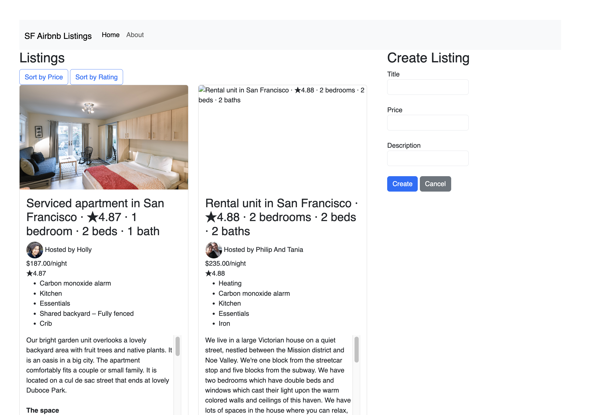

# SF Airbnb Listings

A web application that displays and manages Airbnb listings in San Francisco.

## 🚀 Live Demo / Deployment

**Visit the deployed site:** [https://yingyik.github.io/airbnb-listings/](https://yingyik.github.io/airbnb-listings/)

The site is deployed using GitHub Pages and is accessible at the link above.

## Project Objective

This project implements a dynamic web page that loads and displays the first 50 Airbnb listings from San Francisco using AJAX (JavaScript Fetch API with async/await). The page displays comprehensive listing information including name, description, amenities, host details (name and photo), price, and thumbnails. Additionally, it features sorting functionality to help users find listings by price or rating.

## Screenshot



## Tech Requirements

- **HTML5**: Semantic markup and structure
- **CSS3**: Custom styling with Flexbox for responsive layout
- **JavaScript (ES6+)**: Modern JavaScript with async/await for asynchronous data loading
- **Bootstrap 5**: Responsive framework for UI components
- **Fetch API**: For loading JSON data asynchronously
- **Modern Browser**: Chrome, Firefox, Safari, or Edge (latest versions)

## How to Install/Use

### Local Development

1. Clone the repository:
```bash
git clone https://github.com/yingyik/airbnb-listings.git
cd airbnb-listings
```

2. Open `index.html` in your browser, or use a local server:

**Using Python:**
```bash
python3 -m http.server 8000
```

**Using Node.js:**
```bash
npx http-server
```

3. Visit `http://localhost:8000` in your browser

### Usage

- Browse through the 50 listings displayed on the main page
- Click "Sort by Price" to sort listings from lowest to highest price
- Click "Sort by Rating" to sort listings from highest to lowest rating
- Click "Rent" button on any listing card (UI element)
- Visit the "About" page to learn more about the project

## Features

- ✅ Dynamic data loading using AJAX (Fetch API with async/await)
- ✅ Displays listing name, description, amenities, host (name and photo), price, and thumbnail
- ✅ Sorting functionality by price and rating
- ✅ Responsive design with Bootstrap 5
- ✅ Clean card-based UI layout

## Author

**YingyiK**

- GitHub: [@yingyik](https://github.com/yingyik)

## Reference to the Class

This project was created as part of the course assignment. Reference to the class repository:

- [Airbnb Listings Demo Page](https://github.com/john-guerra/Airbnb_Listings_demo_page)

## Project Structure

```
airbnb/
├── index.html                    # Main page with listings
├── about.html                    # About page
├── css/
│   └── main.css                 # Custom styles
├── js/
│   └── main.js                  # JavaScript logic (AJAX, sorting)
├── airbnb_sf_listings_500.json  # Data source (500 listings)
└── README.md                     # This file
```

## License

This project is for educational purposes.
